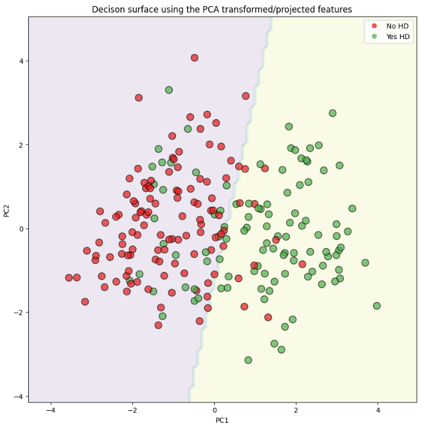
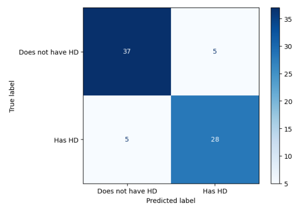
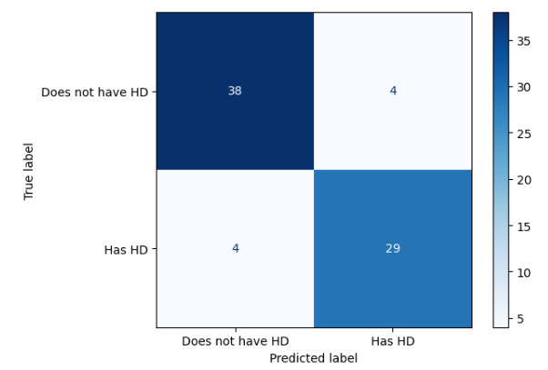
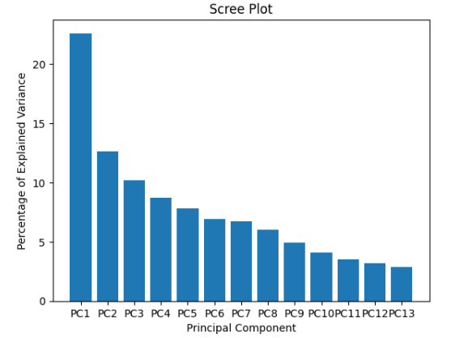

# 🩺 Heart Disease Prediction using Support Vector Machines (SVM)

<p align="center">
  
</p>

This repository contains a step-by-step implementation of a **Support Vector Machine (SVM)** model to predict heart disease.  
The notebook walks through data loading, preprocessing, model building, hyperparameter tuning, and performance evaluation.

---

## 📌 Project Overview

Heart disease is one of the leading causes of death worldwide.  
This project aims to build a machine learning model that predicts whether a person is likely to have heart disease based on clinical features.

Key highlights:
- **End-to-end ML pipeline**: Data loading → Cleaning → Feature Engineering → Model Training → Evaluation.
- **SVM Classifier**: Trained and optimized with cross-validation.
- **Performance Metrics**: Accuracy, Confusion Matrix, and ROC Curve.
- **Reproducible Notebook**: Well-documented and easy to follow.

---

## 📂 Repository Structure

```bash
├── Heart Disease Prediction with Support Vector Machines(SVM).ipynb  # Main Jupyter Notebook
├── README.md                                                        # Project documentation
└── requirements.txt                                                 # Python dependencies
```

---

## ⚙️ Installation & Setup

Clone this repository and install the dependencies:

```bash
git clone https://github.com/your-username/heart-disease-prediction-svm.git
cd heart-disease-prediction-svm

# (Optional) Create and activate virtual environment
python -m venv venv
source venv/bin/activate  # On Windows: venv\Scripts\activate

# Install required libraries
pip install -r requirements.txt
```

---

## 🧠 How to Run

1. Open Jupyter Notebook:
   ```bash
   jupyter notebook
   ```
2. Run the notebook step by step:
   - **Task 1–4:** Import libraries, load data, handle missing values.
   - **Task 5–7:** Feature preparation, encoding, and scaling.
   - **Task 8–10:** Train, tune, and evaluate the SVM classifier.

---

## 📊 Results

The notebook provides:
- **Confusion Matrix** for classification performance
- **ROC Curve & AUC** for model discrimination power
- **Final Accuracy & Metrics**

*(Include sample output images if available — confusion matrix, ROC curve, etc.)*

---

## 📷 Example Output
<h3 align="center">Confusion Matrices Before and After Optimization</h3>
<p align="center">
  
  
</p>

<h3 align="center">PCA Scree Plot</h3>
<p align="center">
  
</p>

<h3 align="center">PCA Analysis</h3>
<p align="center">
  
  
</p>


---

## 📌 Requirements

Here’s the `requirements.txt` you can include in your repository:

```txt
matplotlib
numpy
pandas
scikit-learn
```

Install using:

```bash
pip install -r requirements.txt
```

---

## 🏗️ Future Improvements

- Try other classifiers (Logistic Regression, Random Forest, XGBoost)
- Add hyperparameter tuning with **GridSearchCV**
- Deploy model using **Flask** or **Streamlit**

---

## 🤝 Contributing

Contributions are welcome!  
Feel free to open an [issue](https://github.com/your-username/heart-disease-prediction-svm/issues) or submit a pull request.

---

## 📜 License

This project is licensed under the MIT License. See [LICENSE](LICENSE) for details.

